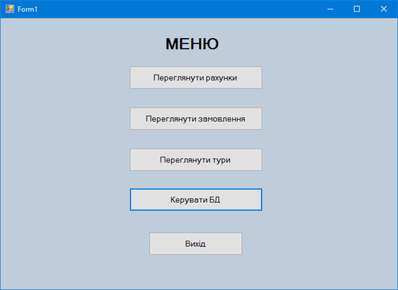
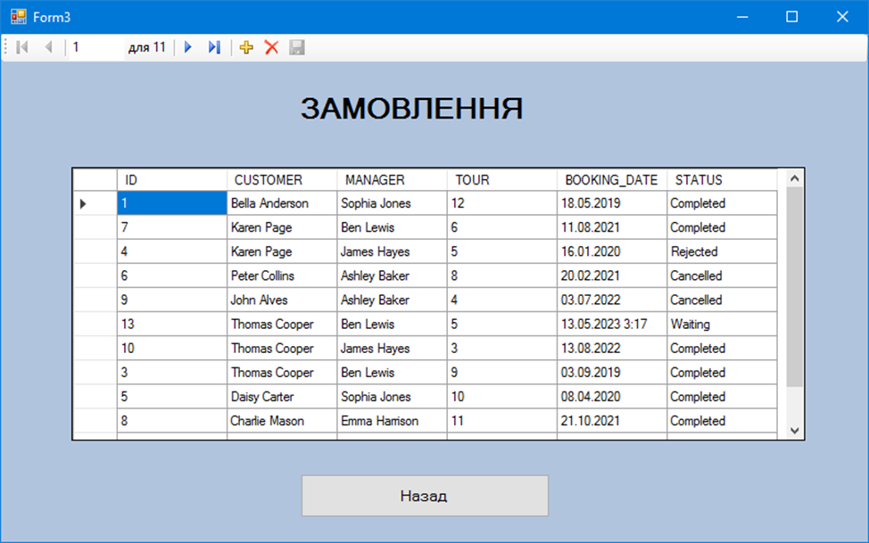
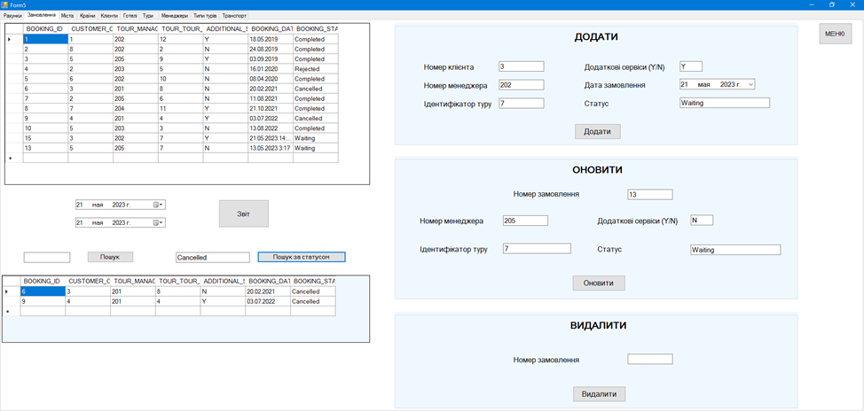
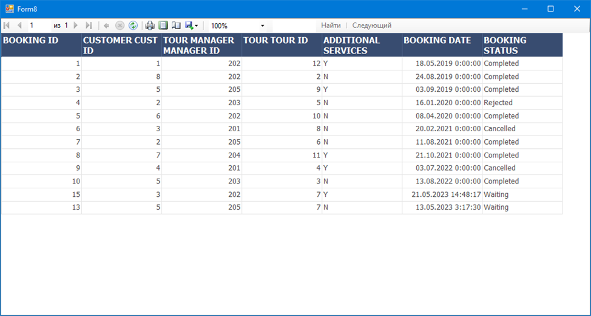

# Інформаційно-пошукова система для туристичної фірми

Проєкт, що поєднує базу даних та застосунок для роботи з нею. Система призначена для оптимізації роботи туристичної фірми шляхом забезпечення швидкого доступу до інформації, зручного пошуку даних, управління замовленнями та аналізу діяльності установи.

## Функціональні можливості:

- реєстрація та обробка замовлень;
- ведення бази клієнтів (паспортні та контактні дані, історія замовлень);
- облік менеджерів та розподіл замовлень між ними;
- ведення каталогів турів (готель, тип туру, транспорт, тривалість, ціна);
- формування та ведення рахунків, управління їх станом;
- управління даними системи (створення, перегляд, редагування та видалення записів);
- пошук та фільтрація даних для зручності перегляду;
- генерація звітів за вибраний період по замовленнях, рахунках та діяльності менеджерів;
- побудова стовпчастих діаграм для аналізу та візуалізації результатів.

## Використані технології

- **Мова програмування:** C# (.NET Framework, WinForms)
- **СУБД:** Oracle Database
- **PL/SQL:** розробка БД, послідовності, тригери, представлення та функції
- **IDE:** MS Visual Studio
- **Додаткові інструменти:** RAD-система для швидкої розробки

## Структура системи та база даних

#### Логічна структура

1. Клієнтський застосунок на C# підключається до Oracle DB.
2. CRUD-операції виконуються через інтерфейс користувача.
3. Генерація звітів та діаграм відбувається на основі даних БД.

#### База даних

База даних включає такі сутності:

| Сутність       | Призначення        |
| -------------- | ------------------ |
| `account`      | Рахунки клієнтів   |
| `booking`      | Замовлення турів   |
| `country`      | Країни             |
| `city`         | Міста              |
| `customer`     | Дані про клієнтів  |
| `hotel`        | Готелі             |
| `tour`         | Тур з деталями     |
| `tour_manager` | Менеджери турфірми |
| `tour_type`    | Типи турів         |
| `transport`    | Типи транспорту    |

- **Тригери** та **послідовності** для автоматичного генерування ключів
- **Представлення (VIEW)** для зручного доступу до агрегованих даних
- **Індекси** для прискорення пошуку по ключових полях

## Інтерфейс користувача

Ключові можливості системи показано на прикладі роботи із замовленнями: перегляд та управління записів, створення звітів для подальшого аналізу.  

  
***Головне меню***

  
***Перегляд замовлень***

  
***Керування замовленнями: додавання, редагування, видалення***

***Перегляд сформованого по замовленнях звіту***

## Запуск проєкту

1. Клонувати репозиторій:  
   `git clone https://github.com/opyvonos/tour-agency-app`
2. Імпортувати SQL-скрипт в Oracle Database
3. Відкрити рішення у Visual Studio
4. Вказати параметри підключення до БД
5. Запустити застосунок