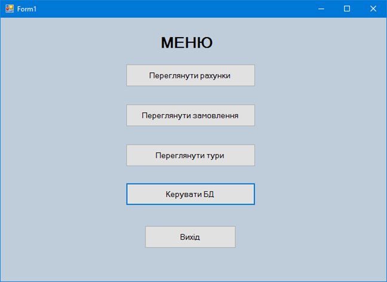
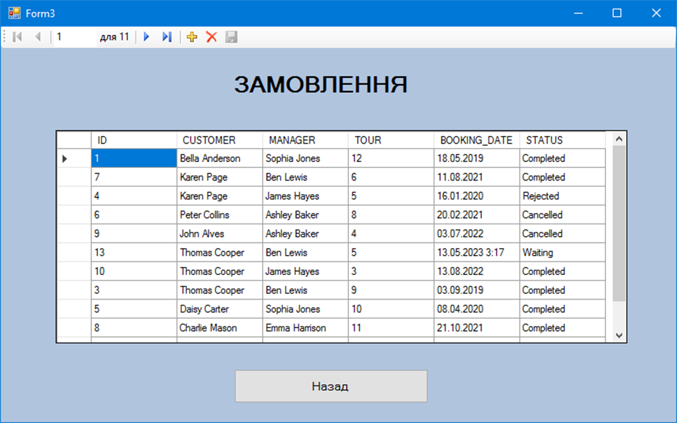
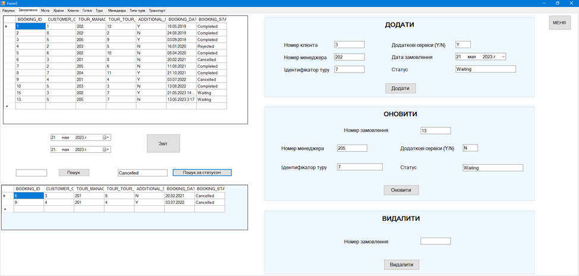
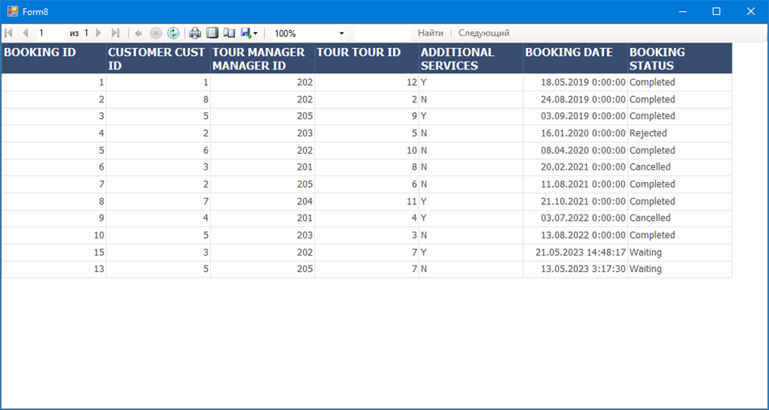

# Information and Search System for a Tour Agency

A desktop application integrated with a relational database to optimize tour agency operations. The system ensures fast access to information, efficient data search, booking management, and business analytics.

## Key Features

- Registration and processing of customer bookings.
- Customer data management (passport data, contact details, booking history).
- Management of tour agency managers and booking assignments.
- Tour catalog management (hotels, tour types, transport, duration, pricing).
- Invoice creation and management, including invoice status tracking.
- CRUD operations for managing system records.
- Data search and filtering for enhanced usability.
- Report generation for selected time periods (bookings, invoices, manager performance).
- Bar chart visualization for business activity analysis.

## Tech Stack

- **Programming Language:** C# (.NET Framework, WinForms)
- **DBMS:** Oracle Database
- **PL/SQL:** Database design, sequences, triggers, views, and stored functions
- **IDE:** MS Visual Studio

## System Architecture & Database

#### Logical Architecture

1. C# desktop client application connects directly to Oracle Database.
2. CRUD operations are performed via the user interface.
3. Reports and analytical charts are generated dynamically based on database queries.

#### Database Architecture

The database includes the following entities:

| Entity         | Description            |
| -------------- | ---------------------- |
| `account`      | Customer invoices      |
| `booking`      | Tour bookings          |
| `country`      | Countries              |
| `city`         | Cities                 |
| `customer`     | Customer personal data |
| `hotel`        | Hotels                 |
| `tour`         | Tour details           |
| `tour_manager` | Tour agency managers   |
| `tour_type`    | Tour types             |
| `transport`    | Transport types        |

- **Triggers** and **sequences** are implemented for automated primary key generation.
- **Views** are used for simplified access to aggregated data.
- **Indexes** are configured to improve the performance of search queries.

## User Interface

Key features are demonstrated through the booking management workflow: viewing and managing records, as well as generating reports for further analysis.  

  
***Main Menu***

  
***View Bookings***

  
***Booking Management: Add, Edit, Delete***

  
***Viewing the Generated Booking Report***

## Getting Started

1. Clone the repository:  
   `git clone https://github.com/opyvonos/tour-agency-app`
2. Import the SQL scripts from the `database` directory into the Oracle Database instance in the following order: `create_table`, `insert_data`, `sequences`, `triggers`, `views`, `indexes`.
3. Open the .sln file in Visual Studio.
4. In the `app.config` file, update the `connectionStrings` section by specifying Oracle Database credentials (DATA SOURCE, USER ID, PASSWORD).
5. Build and launch the project from Visual Studio.
